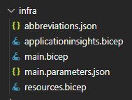
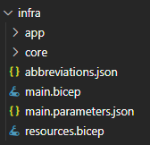
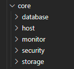

# Sample compatibility journey for the Azure Developer CLI - Updates with azd 0.2.0-beta.2

> ⚠ **The steps and the code presented in this branch are described and built in accordance to the Azure Developer CLI version [0.2.0-beta.2 (2022-09-21)](https://github.com/Azure/azure-dev/releases/tag/azure-dev-cli_0.2.0-beta.2)**

## Introduction

With the update of the Azure Developer CLI to version [0.2.0-beta.2 (2022-09-21)](https://github.com/Azure/azure-dev/releases/tag/azure-dev-cli_0.2.0-beta.2) a change was introduced that affects the structuring of the bicep templates i.e. structuring them via modules (see also pull request [Rearrange Bicep Modules #548](https://github.com/Azure/azure-dev/pull/548)).

## What has changed

Up to the version 0.2.0-beta.1 the `infra` folder contained the bicep files in a structured but "flat" manner. The structure was well defined, but all files have been gathered in one directory:

Although this setup is easy to understand and might be a good fit for small projects, it will face some limitations:

- The more complex the setup is becoming the bigger the `resources-bicep` file will become. This will decrease the maintainability and the code will be hard to understand. The mitigation would be to split the files. This can again become messy and governance needs to be put in place to assure a uniform structuring across projects
- Quite some copy and paste must happen in between projects, so even after introducing `azd` as best practice fpr development teams in a company with the goal to unify the infra structure provisioning each team must take care to keep central resource definition up to date.

The creators of the `azd` seem to be well aware of this and their solution proposal is available with version 0.2.0-beta.**2** of the Azure Developer CLI. The main change is that the bicep files are refactored into [modules](https://learn.microsoft.com/azure/azure-resource-manager/bicep/modules). The new infra folder has the following structure:

While the foundational files like `main.bicep` and `resources.bicep` remain, we see two new folder namely `app` and `core`. Let us take a closer look into them.

### The `core` folder

The `core` folder can be interpreted as the central reuse folder comprising a repository of resources that are used in the different sample projects. The structure is based on the semantics of the resources contained in the folders, like `storage`, `database` or `security`:

In the different folders we find the corresponding `*.bicep` files of the resources. So instead of explicitly coding the different resources in the `resource.bicep` file they are referenced via [modules](https://learn.microsoft.com/azure/azure-resource-manager/bicep/modules). So the redundant code gets removed. 

### The `app` folder

The resources that define your app are placed in a dedicated folder called `app`. The reuse via the `core` folder is established via bicep modules. This leads to an overall cleaner setup compared to the one in prior azd versions.

## Refactoring the Azure Functions Sample

Although the setup looks cleaner and is well separated, to get a real impression I decided to test it for an existing azd-compatible project. The starting point is the azd-compatible Azure Functions project that I described in the blog post [The Azure Developer CLI - Compatibility journey for an Azure Functions Project](https://dev.to/lechnerc77/the-azure-developer-cli-compatibility-journey-for-an-azure-functions-project-3mc1).

- renamed the infra folder to infra 1 (referencing possible via azure.yaml)
- new folder infra
- copy:
  - abbreviations main, main.parameters, resources from old infra
  - complete core from a sample project

- New folder app
  - function.bicep
  - storage-output.bicep

main and main parameters remain unchanged

resources gets changed

## My 2 cent

- Decent understanding of bicep is necessary as more features are used
- reuse is hard to define up front, but good structure imho
- You must go down the rabbit hole:
api.bicep -> functions-node.bicep -> functions.biscep -> appservice.bicep -> 

- Only first step, I think the procedure itself should be used as a pattern
- Overhead of files ... or not?

## Useful references

Useful references if you want to try things out on your own:

- [azd documentation](https://learn.microsoft.com/azure/developer/azure-developer-cli/overview?tabs=nodejs)
- [bicep documentation](https://learn.microsoft.com/azure/azure-resource-manager/bicep/)
- [bicep playground](https://bicepdemo.z22.web.core.windows.net/)
- [Azure Developer CLI (azd) – September 2022 Release](https://devblogs.microsoft.com/azure-sdk/azure-developer-cli-azd-september-2022-release/) - information and links for Terraform
