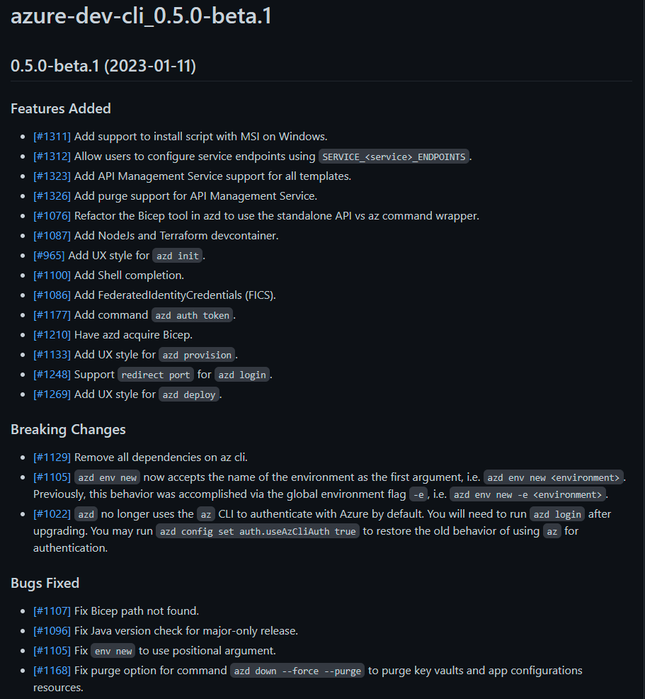
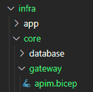

# Sample compatibility journey for the Azure Developer CLI - Updates with azd 0.4.0-beta.1

> ⚠ **The steps and the code presented in this branch are described and built in accordance to the new infrastructure setup Azure Developer CLI version [0.5.0-beta.3](https://github.com/Azure/azure-dev/releases/tag/azure-dev-cli_0.5.0-beta.3) and later**

## Introduction

The new year 2023 started with the release of a new version of the Azure Developer CLI namely version [0.5.0-beta3](https://github.com/Azure/azure-dev/releases/tag/azure-dev-cli_0.5.0-beta.1). This release brought several updates. 
From my perspective the focus of this release is cleaning and leaning up things under the hood. However, these changes also impact some artifacts of the setup.

So let us continue with the game we started a while ago and let us see what we would need to change in our Azure Functions project to move from version 0.4.0-beta.1 to the currently latest and greatest version 0.5.0-beta.3.

> 📝 Remark: The setup presented here is also valid with the CLI version [0.5.0-beta.3](https://github.com/Azure/azure-dev/releases/tag/azure-dev-cli_0.5.0-beta.3).

## What has changed?

First things first, this release contains a ton of updates, bug fixes but also some *breaking changes*:



I will not walk through each and every change in this blog post but highlight the ones that I think are most important when updating your existing `azd`-compatible project. Therefore I highly recommend to walk-through the release note yourself as there might be some gems you are waiting for.

### Installation/Update

First things first: up to now I could update the CLI with the Powershell command (I am working on Windows) that installs it as described on the GitHub page of the CLI. This time this did not work. I executed the command:

```powershell
powershell -ex AllSigned -c "Invoke-RestMethod 'https://aka.ms/install-azd.ps1' | Invoke-Expression"  
```

and the output stated that the CLI was updated to the latest version (at that point 0.5.0-beta.1) but it was not. I first had to uninstall the CLI via:

```powershell
powershell -ex AllSigned -c "Invoke-RestMethod 'https://aka.ms/uninstall-azd.ps1' | Invoke-Expression"
```

and then install it which did the trick. I guess this is connected to the PR [#1311](https://github.com/Azure/azure-dev/pull/1311) (Add support to install script with MSI on Windows).

After that the updates to the consequent beta versions `0.5.0-beta2` and `0.5.0-beta3` worked as before, so everything is working as expected again.

> 📝 Remark: If you want to uninstall `azd` versions > 0.5.0 on Windows you must use the `Add/Remove programs` option in Windows.

### The new logon experience

Until version `0.4.0-beta.1` the log on to Azure was executed via the Azure CLI. This was a bit of a break in the flow of the user first using the Azure CLI and then `azd`. This break was removed with version 0.5.0-beta1, so you can now use the new command:

```powershell
azd login
```

to log into your Azure subscription. This makes the experience smoother and more self contained, but also has an impact to the setup of the CI/CD artifacts provided by `azd`. You can switch back to the old behavior of `azd` by setting the following configuration:

```powershell
azd config set auth.useAzCliAuth true
```

> **Attention**: there was a bug in version 0.5.0-beta.1 when you tried to logon to a personal account. This failed, but was fixed with version [0.5.0-beta.2](https://github.com/Azure/azure-dev/releases/tag/azure-dev-cli_0.5.0-beta.2). However now the `azd init` command does not show any subscriptions, see issue [1398](https://github.com/Azure/azure-dev/issues/1398) when using the new logon flow. For the time being I recommend to use the fallback behavior for personal accounts.

### Changes in the CI/CD setup

As a consequence from the changes of the logon flow, the templates used for the setup of GitHub Actions as well as for the Azure DevOps pipeline need to be adjusted.

For the GitHub Action the logon part must be completely exchanged and has the following content:

```yaml
# https://learn.microsoft.com/en-us/azure/developer/github/connect-from-azure?tabs=azure-portal%2Clinux#set-up-azure-login-with-openid-connect-authentication
permissions:
  id-token: write
  contents: read

jobs:
  build:
    runs-on: ubuntu-latest
    container:
      image: mcr.microsoft.com/azure-dev-cli-apps:latest
    env:
      AZURE_CLIENT_ID: ${{ secrets.AZURE_CLIENT_ID }}
      AZURE_TENANT_ID: ${{ secrets.AZURE_TENANT_ID }}
      AZURE_SUBSCRIPTION_ID: ${{ secrets.AZURE_SUBSCRIPTION_ID }}
      AZURE_CREDENTIALS: ${{ secrets.AZURE_CREDENTIALS }}

    steps:
      - name: Checkout
        uses: actions/checkout@v3

      - name: Log in with Azure (Federated Credentials)
        if: ${{ env.AZURE_CLIENT_ID != '' }}
        run: |
          azd login `
            --client-id "$Env:AZURE_CLIENT_ID" `
            --federated-credential-provider "github" `
            --tenant-id "$Env:AZURE_TENANT_ID"
        shell: pwsh

      - name: Log in with Azure (Client Credentials)
        if: ${{ env.AZURE_CREDENTIALS != '' }}
        run: |
          $info = $Env:AZURE_CREDENTIALS | ConvertFrom-Json -AsHashtable;
          Write-Host "::add-mask::$($info.clientSecret)"

          azd login `
            --client-id "$($info.clientId)" `
            --client-secret "$($info.clientSecret)" `
            --tenant-id "$($info.tenantId)"
        shell: pwsh
        env:
          AZURE_CREDENTIALS: ${{ secrets.AZURE_CREDENTIALS }}
```

In contrast to the release note the templates provide two flow options to logon to azure via `azd` leveraging the new optionsof the `azd` command. The second option with the *client credentials* represents the replacement of the old step with the new flow.

When it comes to Azure DevOps there is still a gap in the new logon flow (for details see issue [1126](https://github.com/Azure/azure-dev/issues/1126)). If you are using this option you need to make the following addition as very first step in the flow:

```yaml
steps:
  - pwsh: |
      azd config set auth.useAzCliAuth "true"
    displayName: Configure azd to Use az CLI Authentication.
```

### New infrastructure templates

With this release the infrastructure setup *per se* remained stable. But we can welcome two new templates for the infrastructure. The first one is also coupled to a new category, namely one for *Azure API Management* that you find in the `gateway` folder:



The second one (and I can proudly say that I contributed that one via [PR](https://github.com/Azure/azure-dev/pull/1197), however it was not mentioned in the official release blog post 😢) is that the *Key Vault Secrets* are now available part of the core templates. 
In my Azure Functions project we still need an own module to do the job. This is due to the nature of the secret string that needs to be constructed manually.
Nevertheless I removed the `core_local` folder with its content and created a new module in the `app` folder called `blobStorageConnectionSecret.bicep`:

```bicep
param name string
param tags object = {}

param keyVaultName string
param blobStorageName string

resource keyVault 'Microsoft.KeyVault/vaults@2022-07-01' existing = {
  name: keyVaultName
}

resource playerStorage 'Microsoft.Storage/storageAccounts@2021-09-01' existing = {
  name: blobStorageName
}

var accessString = 'DefaultEndpointsProtocol=https;AccountName=${playerStorage.name};AccountKey=${playerStorage.listKeys().keys[0].value};EndpointSuffix=core.windows.net'

//attach output storage to keyvault
module outputStorageSecret '../core/security/keyvault-secret.bicep' = {
  name: 'keyVaultSecretForBlob'
  params: {
    name: name
    tags: tags
    keyVaultName: keyVault.name
    secretValue: accessString
  }
}
```

Basically that is the same as the previous module but now uses the `keyvault-secret.bicep` from the official `core` folder. In addition we also need to adjust the `main.bicep` i.e., remove the previous custom module and replace it with the new one:

```bicep
// Add Connection String to KeyVault
module blobStorageConnectionSecret 'app/blobStorageConnectionSecret.bicep' = {
  name: 'blobStorageConnectionSecret'
  scope: rg
  params: {
    name: blobStorageSecretName
    tags: tags
    blobStorageName: outputstorage.outputs.name
    keyVaultName: keyVault.outputs.name
  }
}
```

> 📝 Remark: Handling of secrets of this type is a bit tricky (for good reasons). You find more information [here](https://learn.microsoft.com/azure/azure-resource-manager/bicep/linter-rule-outputs-should-not-contain-secrets).

### Devcontainer setup

The refactoring in release 0.5.0-beta.1 of the `azd` removed the dependency of the Azure CLI (see PR [1129](https://github.com/Azure/azure-dev/pull/1129)). This has an impact on the setup of the development container and should lead to a faster first startup.

The new Dockerfile has the following content now:

```dockerfile
ARG VARIANT=bullseye
FROM --platform=amd64 mcr.microsoft.com/vscode/devcontainers/base:0-${VARIANT}
RUN curl https://packages.microsoft.com/keys/microsoft.asc | gpg --dearmor > microsoft.gpg \
    && mv microsoft.gpg /etc/apt/trusted.gpg.d/microsoft.gpg \
    && sh -c 'echo "deb [arch=amd64] https://packages.microsoft.com/debian/$(lsb_release -rs | cut -d'.' -f 1)/prod $(lsb_release -cs) main" > /etc/apt/sources.list.d/dotnetdev.list' \
    && apt-get update && apt-get install -y xdg-utils \
    && apt-get update && apt-get install -y azure-functions-core-tools-4 \
    && apt-get clean -y && rm -rf /var/lib/apt/lists/*
RUN curl -fsSL https://aka.ms/install-azd.sh | bash
```

The only change to prior versions is that the `xdg-utils` is now installed as an additional package.

The `devcontainer.json` now does no longer contain the Azure CLI as feature and looks like this:

```json
 { 
...
 "features": {
        "ghcr.io/devcontainers/features/docker-from-docker:1": {
            "version": "20.10"
        },
        "ghcr.io/devcontainers/features/github-cli:1": {
            "version": "2"
        },
        "ghcr.io/devcontainers/features/node:1": {
            "version": "16",
            "nodeGypDependencies": false
        }
    },
...
}    
```

> **Attention**: As mentioned before the fetching of subscriptions for personal Azure accounts in `azd init` is broken up to release [0.5.0-beta.3](https://github.com/Azure/azure-dev/releases/tag/azure-dev-cli_0.5.0-beta.2) as reported in issue [1398](https://github.com/Azure/azure-dev/issues/1398). If you are working with a personal account and a devcontainer or GitHub Codespaces you should keep the Azure CLI feature in your `devcontainer.json` like implemented [here](https://github.com/lechnerc77/azd-compatibility-azure-function/blob/azd-040-beta1/.devcontainer/devcontainer.json).

### CLI UX style

Quite some work has been put into the UX of the CLI output. In my opinion it looks better and gives a clearer overview what is happening e.g., when provisioning the infrastructure:

[!CLI deployment output](./assets/deployment-output.png)

It was also aligned across different commands to have a consistent experience. This is appreciated. 

However, some commands could also benefit from an UX improvement e.g., the output of the command `azd template list`.

### And more

As mentioned in the beginning there are several more additions in the release like [shell completion](https://github.com/Azure/azure-dev/pull/1100), [FederatedIdentityCredentials](https://github.com/Azure/azure-dev/pull/1086) or the new command [azd auth token](https://github.com/Azure/azure-dev/pull/1177). Although not all new features and fixes are not relevant to update your `0.4.0-beta.x` setup to `0.5.0-beta.x`, there might be some features you have been waiting for. So check the [release note](https://github.com/Azure/azure-dev/releases/tag/azure-dev-cli_0.5.0-beta.1) and maybe find some more helpful new features you might have been waiting for.  

## Summary

As usual **kudos** to the Azure Developer CLI team and the work they do in pushing the CLI forward. In contrast to the other releases up to now this release contains a lot of refactoring and new core functionality. I like it and I think it is the right direction. 

Having said that this is also the first release that is a bit more of a bumpy experience compared to the previous ones. If you install this version be aware that there are some rough edges compared to the previous upgrades. The good thing is at least from my experience porting two projects to the new version is that there are workarounds and you do not hit a dead end with any of the bugs. The response time to issues is also quite fast. I would also assume that there is a bit of room for improvement with respect to regression tests of the `azd`.

So keep it coming Azure Developer CLI team, looking forward to the next iterations!

## Where to find the code

You find the code and the description of the project here (mind the branch):

<https://github.com/lechnerc77/azd-compatibility-azure-function/tree/azd-050-beta3>

The latest and greatest project code is in the [main branch](https://github.com/lechnerc77/azd-compatibility-azure-function) which might deviate from the code described in this blog post.

## Useful references

Useful references if you want to try things out on your own:

- [azd documentation](https://learn.microsoft.com/azure/developer/azure-developer-cli/overview?tabs=nodejs)
- [azd on GitHub](https://github.com/Azure/azure-dev)
- [bicep documentation](https://learn.microsoft.com/azure/azure-resource-manager/bicep/)
- [bicep playground](https://bicepdemo.z22.web.core.windows.net/)
- [Azure Developer CLI (azd) – September 2022 Release](https://devblogs.microsoft.com/azure-sdk/azure-developer-cli-azd-september-2022-release/) - information and links for Terraform
- [Azure Developer CLI (azd) – October 2022 Release](https://devblogs.microsoft.com/azure-sdk/azure-developer-cli-azd-october-2022-release/)
- [Azure Developer CLI (azd) – November 2022 Release](https://devblogs.microsoft.com/azure-sdk/azure-developer-cli-azd-november-2022-release/)
- [Azure Developer CLI (azd) – January 2023 Release](https://devblogs.microsoft.com/azure-sdk/azure-developer-cli-azd-january-2023-release/)
- [QuickGlance - Azure Developer CLI](https://youtube.com/playlist?list=PLmZLSvJAm8FbFq2XhqaPZgIzl6kewz1HD)
- [The Azure Developer CLI - Compatibility journey for an Azure Functions Project](https://dev.to/lechnerc77/the-azure-developer-cli-compatibility-journey-for-an-azure-functions-project-3mc1)
- [Azure Developer CLI - How does it know that?](https://dev.to/lechnerc77/azure-developer-cli-how-does-it-know-that-1ngl)
