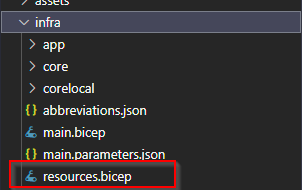
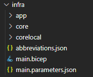

# Sample compatibility journey for the Azure Developer CLI - Updates with azd 0.4.0-beta.1

> ⚠ **The steps and the code presented in this branch are described and built in accordance to the new infrastructure setup Azure Developer CLI version [0.4.0-beta.1 (2022-11-02)](https://github.com/Azure/azure-dev/releases/tag/azure-dev-cli_0.4.0-beta.1) and later**

## Introduction

With the updates of the Azure Developer CLI to version [0.3.0-beta3](https://github.com/Azure/azure-dev/releases/tag/azure-dev-cli_0.3.0-beta.3) and finally [0.4.0-beta.1 (2022-11-02)](https://github.com/Azure/azure-dev/releases/tag/azure-dev-cli_0.2.0-beta.2) simplifications were introduced that affect the structuring of the `bicep` templates. The overall layout was simplified and the bicep templates from the core library have been re-structured and improved..

> 📝 Remark: The setup presented here is also valid with the CLI version [0.4.0-beta.1](https://github.com/Azure/azure-dev/releases/tag/azure-dev-cli_0.4.0-beta.1).

## What has changed

We start with the setup that was state-of-the-art with version 0.2.0-beta.2 and take it from there.

### devcontainer.json

Change in the setup of the `devcontainer.json`. The deprecated syntax of the feature description is updated and references the features  via [https://github.com/devcontainers](https://github.com/devcontainers)

This brings us from here:

```json
"features": {
        "github-cli": "2",
        "azure-cli": "2.40",
        "docker-from-docker": "20.10",
        "node": {
            "version": "16",
            "nodeGypDependencies": false
        }
    }
```

to the new setup:

```json
"features": {
        "ghcr.io/devcontainers/features/azure-cli:1": {
            "version": "2.40"
        },
        "ghcr.io/devcontainers/features/docker-from-docker:1": {
            "version": "20.10"
        },
        "ghcr.io/devcontainers/features/github-cli:1": {
            "version": "2"
        },
        "ghcr.io/devcontainers/features/node:1": {
            "version": "16",
            "nodeGypDependencies": false
        }
    }
```

### The infrastructure setup

The main new hot stuff for me is the restructuring of the `.bicep` infrastructure. Yes they did it again, and I like what they did, as it makes my setup easier and improves the transparency what happens without too many hops due to layers of abstraction. The restructuring has some impact: compared to the prior version there are now:

- new/different templates with new/different parameters
- a new file structure

> 📝 Remark: there are also new `.bicep` files due to completely new templates (like the C# one).

So as in the prior restructurings of the infrastructure setup I created the Static Web App (SWA) sample for Node.js as a blueprint in a different folder. I copied the new `core` folder, as well as the `abbreviations.json` and the `main.parameters.json` into my existing project. After that I copied the `main.bicep` from my old setup. But wait, isn't there a file missing? Yes and that is one main difference in the new setup compared to prior versions: there is no `resources.bicep` file any more. Everything has moved to `main.bicep`.

The old structure looked like this:



while the new one has this setup now:



> 📝 Remark: Time will show if this is a good approach for complex projects or not. Having said that, this is of course an optional change, you can leave the structure as is, if this is beneficial for your use case.

Now we have a mixed setup with my files from `azd` version 0.2.0-beta.2, i.e., the `app` and the `corelocal` folder with my extensions specific for my use case.

Following the approach of putting everything into the `main.bicep` which at least for my sample setup it makes life easier, I copy all the resource definitions form the old `resources.bicep` into the `main.bicep` - brute force style. That meant: *Welcome to the universe of the curly red underlines* as of course this file is far from being a valid `.bicep` file.

After breaking it, let's fix it. I started with the low-hanging fruits by copying the app-agnostic building blocks from the SWA sample to my `main.bicep`. This comprises:

- the header with new/additional parameters
- the new resource group definition
- the monitoring part
- the Azure Key Vault part

As the referencing of several parameters pointed in the wrong direction due ot the copy&paste action, I had to adjust several parameters like the ones of the Azure Key Vault. This was straight forward and went smooth due to the type-ahead support of the bicep extension for VSCode. After that at least some parts of the `main.bicep` became valid again.

> 📝 Remark: When you do the migration, I recommend to take a look at the new naming conventions for the parameters of the different modules. This is consistent over all files and makes a more flexible setup of your resources possible. We will see that in a second.

One additional point that changed in the setup is that the Azure Key Vault *access* is now an explicit part of the sample setup using the `keyvault-access.bicep` module. This module was already available in the prior versions but was not used. To the Azure Key Vault comprises two blocks:

```yaml
// Store secrets in a keyvault
module keyVault './core/security/keyvault.bicep' = {
  name: 'keyvault'
  scope: rg
  params: {
    name: !empty(keyVaultName) ? keyVaultName : '${abbrs.keyVaultVaults}${resourceToken}'
    location: location
    tags: tags
    principalId: principalId
  }
}

// Give the API access to KeyVault
module apiKeyVaultAccess './core/security/keyvault-access.bicep' = {
  name: 'api-keyvault-access'
  scope: rg
  params: {
    keyVaultName: keyVault.outputs.name
    principalId: function.outputs.FUNCTION_IDENTITY_PRINCIPAL_ID
  }
}
```

This sample also reflects the clean naming conventions for the resources and the parameters that are consistent over all `.bicep` modules.

The setup of the App service plan as well as for the storage attached to the Azure Function is straightforward and I took that from the SWA sample.

With that we can move to the specifics of the sample Azure Function I am using:

- one additional dedicated storage account with a Blob storage container
- a secret in the Azure Key Vault for accessing the Blob storage from the Azure Function

Due to some restrictions in the previous `azd` version, I had to create my own `.bicep` module for the storage as I could not create a storage with a new name. There was also no option to specify a container within a storage account. With the new `azd` version this is possible. This means that I can get rid of my custom built modules and use the modules from the core folder provided by `azd`. The new setup of my additional storage account looks like this:

```yaml
// Second Storage Account for Output Binding
module outputstorage './core/storage/storage-account.bicep' = {
  name: 'outputstorage'
  scope: rg
  params: {
    name: blobStorageForPlayersName
    location: location
    tags: tags
    containers: [
      {
        name: storageContainerName
      }
    ]
  }
}
```

That's cool and gives me a leaner setup.

The definition of the secret is not (yet) part of the `core` modules delivered by Microsoft, so I sticked to my existing custom module from the prior setup. To be consistent I aligned the parameters with the one of the `core` modules, so the new `keyvault-blobaccess-secret.bicep` looks like:

```yaml
param name string
param tags object = {}

param keyVaultName string
param blobStorageName string

resource keyVault 'Microsoft.KeyVault/vaults@2022-07-01' existing = {
  name: keyVaultName
}

resource playerStorage 'Microsoft.Storage/storageAccounts@2021-09-01' existing = {
  name: blobStorageName
}

resource keyVaultSecret 'Microsoft.KeyVault/vaults/secrets@2022-07-01' = {
  name: name
  tags: tags
  parent: keyVault
  properties: {
    contentType: 'string'
    value: 'DefaultEndpointsProtocol=https;AccountName=${playerStorage.name};AccountKey=${playerStorage.listKeys().keys[0].value};EndpointSuffix=core.windows.net'
  }
}
```

This leads to the following entry in the `main.bicep`:

```yaml
/attach output storage to keyvault
module outputStorageSecret './corelocal/security/keyvault-blobaccess-secret.bicep' = {
  name: 'keyVaultSecretForBlob'
  scope: rg
  params: {
    name: blobStorageSecretName
    tags: tags
    blobStorageName: outputstorage.outputs.name
    keyVaultName: keyVault.outputs.name
  }
}
```

Finally the `/app/function.bicep` needed to be cleaned up to reference the new *single* `.bicep` module for Azure Functions:

```yaml
param name string
param location string = resourceGroup().location
param tags object = {}

param allowedOrigins array = []
param applicationInsightsName string = ''
param appServicePlanId string
param appSettings object = {}
param keyVaultName string
param serviceName string = 'blob-output-binding'
param storageAccountName string

module function '../core/host/functions.bicep' = {
  name: '${serviceName}-functions-node-module'
  params: {
    name: name
    location: location
    tags: union(tags, { 'azd-service-name': serviceName })
    allowedOrigins: allowedOrigins
    alwaysOn: false
    appSettings: appSettings
    applicationInsightsName: applicationInsightsName
    appServicePlanId: appServicePlanId
    keyVaultName: keyVaultName
    runtimeName: 'node'
    runtimeVersion: '16'
    storageAccountName: storageAccountName
  }
}

output FUNCTION_IDENTITY_PRINCIPAL_ID string = function.outputs.identityPrincipalId
output FUNCTION_NAME string = function.outputs.name
output FUNCTION_URI string = function.outputs.uri
```

As you can see no more language-specific templates. I like that approach as I think it is more transparent for the developer without the drawback to make the developer drown in unnecessary complexity. From my point of view the prior setup although  hiding some parameters was more cumbersome.

The new parameters need to be reflected in the `main.bicep`. The corresponding section looks like this:

```yaml
// The function app
module function './app/function.bicep' = {
  name: 'function'
  scope: rg
  params: {
    name: !empty(functionName) ? functionName : '${abbrs.webSitesFunctions}api-${resourceToken}'
    location: location
    tags: tags
    applicationInsightsName: monitoring.outputs.applicationInsightsName
    appServicePlanId: appServicePlan.outputs.id
    keyVaultName: keyVault.outputs.name
    storageAccountName: storage.outputs.name
    appSettings: {
      BLOB_STORAGE_CONNECTION_STRING: '@Microsoft.KeyVault(SecretUri=${keyVault.outputs.endpoint}secrets/${blobStorageSecretName})'
    }
  }
}
```

And that was it - everything is up and running again proven by a simple `azd up`!

## More news

Over the last releases some more improvements have been made (like `azd configure`), you find a complete overview in the following blog posts:

- [Azure Developer CLI (azd) – October 2022 Release](https://devblogs.microsoft.com/azure-sdk/azure-developer-cli-azd-october-2022-release/)
- [Azure Developer CLI (azd) – November 2022 Release](https://devblogs.microsoft.com/azure-sdk/azure-developer-cli-azd-november-2022-release/)

## Summary

It is great to see the continuos improvements around the Azure Developer CLI. Especially the infrastructure part is continuously moving forward and the usability as well as the developer experience is improving in every iteration (at least this is my experience).

Looking forward to the next iterations of the tool!

## Where to find the code

You find the code and the description of the project here (mind the branch):

<https://github.com/lechnerc77/azd-compatibility-azure-function/tree/azd-040-beta1>

The latest and greatest project code is in the [main branch](https://github.com/lechnerc77/azd-compatibility-azure-function) which might deviate from the code described in this blog post.

## Useful references

Useful references if you want to try things out on your own:

- [azd documentation](https://learn.microsoft.com/azure/developer/azure-developer-cli/overview?tabs=nodejs)
- [azd on GitHub](https://github.com/Azure/azure-dev)
- [bicep documentation](https://learn.microsoft.com/azure/azure-resource-manager/bicep/)
- [bicep playground](https://bicepdemo.z22.web.core.windows.net/)
- [Azure Developer CLI (azd) – September 2022 Release](https://devblogs.microsoft.com/azure-sdk/azure-developer-cli-azd-september-2022-release/) - information and links for Terraform
- [Azure Developer CLI (azd) – October 2022 Release](https://devblogs.microsoft.com/azure-sdk/azure-developer-cli-azd-october-2022-release/)
- [Azure Developer CLI (azd) – November 2022 Release](https://devblogs.microsoft.com/azure-sdk/azure-developer-cli-azd-november-2022-release/)
- [QuickGlance - Azure Developer CLI](https://youtube.com/playlist?list=PLmZLSvJAm8FbFq2XhqaPZgIzl6kewz1HD)
- [The Azure Developer CLI - Compatibility journey for an Azure Functions Project](https://dev.to/lechnerc77/the-azure-developer-cli-compatibility-journey-for-an-azure-functions-project-3mc1)
- [Azure Developer CLI - How does it know that?](https://dev.to/lechnerc77/azure-developer-cli-how-does-it-know-that-1ngl)
