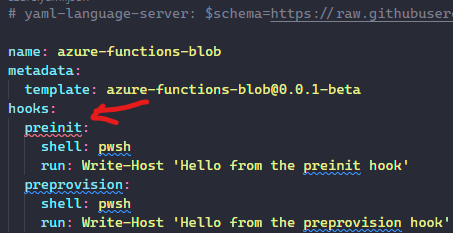
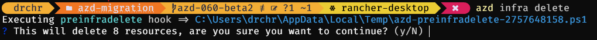
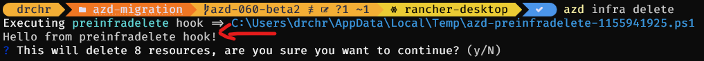
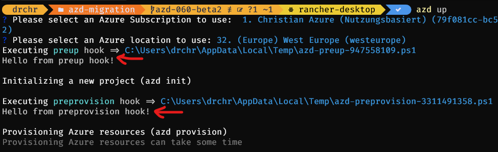
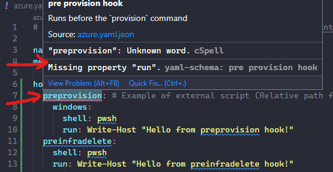
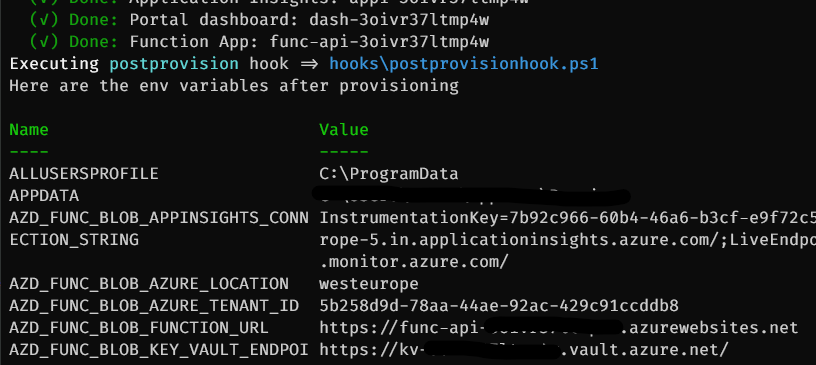

# Sample compatibility journey for the Azure Developer CLI - Updates with azd 0.6.0-beta.2

> ⚠ **The steps and the code presented in this branch are described and built in accordance to the new infrastructure setup Azure Developer CLI version [0.6.0-beta.2](https://github.com/Azure/azure-dev/releases/tag/azure-dev-cli_0.6.0-beta.2) and later**

> ⚠ **Note** - All updates in the `azd` version 0.7.0 (see [release notes](https://github.com/Azure/azure-dev/releases/tag/azure-dev-cli_0.7.0-beta.1)) do not imply any changes in the project setup. So this branch can also be used with version 0.7.0-beta1 without any changes or adjustments.

## Introduction

It is the beginning of February and that means ... (short drum roll) ... the new monthly version of the Azure Developer CLI is out! So welcome version [0.6.0-beta2](https://github.com/Azure/azure-dev/releases/tag/azure-dev-cli_0.6.0-beta.2).

So same procedure as last month: let us see what we would need to change in our Azure Functions project to move from version 0.5.0-beta.3 to the currently latest and greatest version 0.6.0-beta.2.

## What has changed?

> 📝 Remark: I will focus on version [0.6.0-beta.1](https://github.com/Azure/azure-dev/releases/tag/azure-dev-cli_0.6.0-beta.1). As usual there might be some newer patch releases coming in the next weeks to fix some glitches (and the first one is already out), but news are part of the 0.6.0-beta.1 release.

The release comes with some nice new features making `azd` more mature and production ready like the support [Support for multiple Azure organizations](https://devblogs.microsoft.com/azure-sdk/azure-developer-cli-azd-february-2023-release/#support-for-multiple-azure-organizations) and a lot of new `azd` templates (see [here](https://devblogs.microsoft.com/azure-sdk/azure-developer-cli-azd-february-2023-release/#new-templates-dapr-python-javascript-and-java) - I have picked my favorite there, but I am a bit biased ☺).

The cool thing is that there are no structural changes that make it necessary to refactor your project to stay fully compatible and up to date. Before you stop reading, stay with me: there are some things that might improve your project and I will focus on them as well as on the rough edges that I came across when upgrading to version 0.5.0-beta3.

Hence, I will not walk through each and every change but highly recommend to walk-through the release note yourself as there might be gems you can use in your setup.

### Installation/Update

Last time the upgrade of the `azd` CLI on Windows was a bit bumpy. I guess that was due to the move towards the MSI based installation for Windows. This was indeed a bug and it was fixed with this release. So as usual the upgrade of the CLI version went smooth without any hazel. I used the PowerShell command described on the GitHub README.md of the `azd` CLI to do the upgrade.

You can now also use `winget` or `brew` for MacOS users to install and upgrade your CLI. I did not try that out, as I personally still did not manage to use one single package manager on Windows. Up to now I always needed to use Chocolatey complementing `winget` due to missing packages - I did not check lately, I live with the "installation mayhem" I am used to.

### The login experience

Version 0.5.0-beta.1 removed the dependency from the Azure CLI for the login to the Azure account. However, that flow did not work if you had a personal Azure account. In case of personal account you had to switch back to the old behavior of `azd` by the configuration `azd config set auth.useAzCliAuth true`.

*Good news* for all the users that needed that workaround - version 0.6.0-beta.1 fixed the behavior and the login flow works like a charm even if you are using a personal account. This means you can remove the workaround and the dependency from:

- from your `azd` configuration via `azd config unset auth`
- the `.devcontainer/devcontainer.json` file
- the GitHub Action workflow file `.github/workflows/azure-dev.yml`

Be aware that there are two scenarios where you still have the dependency to the Azure CLI to execute the login flow namely:

- when you are using Azure DevOps for CI/CD and use the pipeline configuration that is delivered with `azd`
- when you are using Terraform as Infrastructure-as-Code. This gap is due to the Terraform provider as described [here](https://registry.terraform.io/providers/hashicorp/azurerm/latest/docs/guides/azure_cli) and also highlighted in the `azd` documentation.

Up to now that looks good. Now let us switch to the biggest new feature that comes with version 0.6.0-beta.1, the command and service hooks.

### New Feature - command and service hooks

When reading about these new "hooks" one song came to my mind ... if you saw Guardians of the Galaxy you know what I am talking about right - "Hooked on a feeling" by Blue Swede?

```shell
Ooga-Chaka Ooga-Ooga
[...]
I'm hooked on a feeling
I'm high on believing
That you're in love with me
[...]
```

With this swing let us dive in the topic itself. In general, this feature gives you additional degrees of freedom by enabling further customization of the `azd` workflow. This means that at certain points in the `azd` command execution you can add custom logic. Why would you need that? Sometimes you might want to execute additional scripted tasks e.g., after your infrastructure was provisioned. With this release you can do that.

`azd` distinguishes two categories of hooks namely *command hooks* and *service lifecycle hooks*. You can hook your custom logic before and after the command/service lifecycle event. You find the complete list of the supported commands in the [documentation](https://learn.microsoft.com/azure/developer/azure-developer-cli/azd-extensibility).

> 📝 Remark: The list of commands in the announcement [blog post](https://devblogs.microsoft.com/azure-sdk/azure-developer-cli-azd-february-2023-release/#new-templates-dapr-python-javascript-and-java) is not complete (the *infradelete events are missing for example), so I recommend to refer to the documentation to get the complete list.

That sounds like a useful feature. I do not have the necessity of these hooks in the Azure Functions project but I have it in another project, so why not give it a spin and play a bit around with these hooks.

The hooks are defined in the `azure.yaml` file like this:

```yaml
name: todo-nodejs-mongo
metadata:
  template: todo-nodejs-mongo@0.0.1-beta
hooks:
  prerestore: 
    shell: sh
    run: echo 'Hello'
  preprovision:
    shell: sh
    run: ./hooks/preprovision.sh
services:
  web:
    project: ./src/web
    dist: build
    language: js
    host: appservice
  api:
    project: ./src/api
    language: js
    host: appservice
```

As we can see we specify the hooks in a `hooks` section and define:

- the event that triggers the hook
- the shell that should be used
- and the code that should be executed either directly as string or as script

Looks not too complicated. Let us try it with the samples from the announcement blog post and the documentation and see how things work.

### The sample code - oops

Taking the sample code and adopting it to PowerShell results in the following `azure.yaml`:

```yaml
# yaml-language-server: $schema=https://raw.githubusercontent.com/Azure/azure-dev/main/schemas/v1.0/azure.yaml.json

name: azure-functions-blob
metadata:
  template: azure-functions-blob@0.0.1-beta
hooks:
  preinit:
    shell: pwsh
    run: Write-Host 'Hello from preinit hook'
  preprovision:
    shell: pwsh
    run: Write-Host 'Hello from preprovision hook'
services:
  blob-output-binding:
    project: src
    language: ts
    host: function
infra:
  path: infra
```

But that leads to a validation error in the editor:



The validation originates form the JSON schema available at <https://raw.githubusercontent.com/Azure/azure-dev/main/schemas/v1.0/azure.yaml.json>.

> 📝 Remark: I was a bit surprised that the version of the JSON schema did not change despite the additional content. I would have expected at least a switch to version 1.1, but this is not the case. At least nothing that needs to be  adjusted when upgrading to the new `azd` version.

Looking into the corresponding section of the JSON schema, you will see that the there are no hooks defined for the `azd init` command. Maybe just an issue in the JSON schema and the `azd` CLI know about the event. But also after trying out the command with the `azure.yaml` from above, no hint that the hook was recognized. Okay so small issue with the sample code. 

Let us give it a try with another event namely `preinfradelete`.

### Interactive or not interactive - that's the question

I adjusted the `azure.yaml` to execute the `preinfradelete` hook:

```yaml
# yaml-language-server: $schema=https://raw.githubusercontent.com/Azure/azure-dev/main/schemas/v1.0/azure.yaml.json

name: azure-functions-blob
metadata:
  template: azure-functions-blob@0.0.1-beta
hooks:
  preinfradelete:
    shell: pwsh
    run: Write-Host "Hello from preinfradelete hook"
services:
  blob-output-binding:
    project: src
    language: ts
    host: function
infra:
  path: infra
```

Giving this configuration a try results in:



Obviously the hook was recognized (and maybe executed), but where is the "Hello from the preinfradelete hook" output? Documentation for the rescue!

There are two more options when defining the configuration for an event namely:

- `interactive`: When set will bind the running script to the console `stdin`, `stdout` & `stderr` (default false).
- `continueOnError`: When set will continue to execute even after a script error occurred during a command hook (default false).

The `interactive: true` is needed otherwise you will not see the output. Next try with:

```yaml
# yaml-language-server: $schema=https://raw.githubusercontent.com/Azure/azure-dev/main/schemas/v1.0/azure.yaml.json

name: azure-functions-blob
metadata:
  template: azure-functions-blob@0.0.1-beta
hooks:
  preinfradelete:
    shell: pwsh
    run: Write-Host "Hello from preinfradelete hook"
    interactive: true
services:
  blob-output-binding:
    project: src
    language: ts
    host: function
infra:
  path: infra
```

Result:



That did the trick. Something that should be added to the corresponding code samples. But first success to celebrate on our side. 

Let us try out some more things.

### azd up - one command to rule them all, but what about the hook

Looking at the possible hooks we see that we can have one for `azd provision` and one for `azd up`. As `azd up` is the one command to rule them all, the question that came to my mind is: if I configure a hook for the event `preprovision` and `preup`, will they both be executed or will just the `up` event be fired as this one overrules the other events?

Let us try it out:

```yaml
# yaml-language-server: $schema=https://raw.githubusercontent.com/Azure/azure-dev/main/schemas/v1.0/azure.yaml.json

name: azure-functions-blob
metadata:
  template: azure-functions-blob@0.0.1-beta
hooks:
  preprovision:
    shell: pwsh
    run: Write-Host "Hello from prepreprovision hook"
    interactive: true
  preup:
    shell: pwsh
    run: Write-Host "Hello from preup hook"
    interactive: true
services:
  blob-output-binding:
    project: src
    language: ts
    host: function
infra:
  path: infra
```

Result:



All hooks are executed and they are executed sequentially where the `preup` event is the very first one. This is important to keep in mind to avoid duplicate executions of activities or scripts.

What can we try out next? The hooks allow a OS dependent definition of the hook configuration, let us take a look at that.

### OS dependency

According to the code samples you can distinguish the OS when defining the hook via:

```yaml
name: todo-nodejs-mongo
metadata:
  template: todo-nodejs-mongo@0.0.1-beta
hooks:
  preinit: 
    posix: # Only runs on Posix environments
      shell: sh
      run: echo 'Hello'
   windows: # Only runs on Windows environments
     shell: pwsh
     run: Write-Host "Hello"
services:
  web:
    project: ./src/web
    dist: build
    language: js
    host: appservice
  api:
    project: ./src/api
    language: js
    host: appservice
```

Adopting that to my project and just giving Windows a try my `azure.yaml` looks like this:

```yaml
name: azure-functions-blob
metadata:
  template: azure-functions-blob@0.0.1-beta
hooks:
  preprovision:
    windows:
      shell: pwsh
      run: Write-Host "Hello from the preprovision hook"
      interactive: true
  preinfradelete:
    shell: pwsh
    run: Write-Host "Hello from preinfradelete hook"
    interactive: true    
services:
  blob-output-binding:
    project: src
    language: ts
    host: function
infra:
  path: infra
```

And as for the `preinit` scenario the editor shows a validation issue:



Hmmm ... checking the JSON schema the reason for that becomes clear:

```json
 "definitions": {
        "hook": {
            "type": "object",
            "additionalProperties": false,
            "required": [
                "run"
            ],
            "properties": {
                "shell": {
                    "type": "string",
                    "title": "Type of shell to execute scripts",
                    "description": "Optional. The type of shell to use for the hook. (Default: sh)",
                    "enum": [
                        "sh",
                        "pwsh"
                    ],
                    "default": "sh"
                },
                "run": {
                    "type": "string",
                    "title": "Required. The inline script or relative path of your scripts from the project or service path",
                    "description": "When specifying an inline script you also must specify the `shell` to use. This is automatically inferred when using paths."
                },
```

`run` is required and defined on top level. The OS dependencies are part of the hook definition, so even when specifying the OS the validation fails due to a missing top-level `run` key.

In contrast to `preinit`, the OS dependency *per se* is part of the schema, so let us check if the `azd` CLI can deal with the inconsistent `azure.yaml` file by executing it. 

The result is: It can, so the issue is just the JSON schema that needs to be corrected.

That's good as this way all developers feel included when using `azd` no matter what OS they are running on. This is *highly appreciated* as I often struggle with not having a Mac and at tooling often treats them as first class citizen.

### How do I get the variables after provisioning

Okay so as we now know the mechanics of the hooks, I have one more question. If I want to do some additional actions after provisioning the infrastructure, how can I get to the relevant information, like the URL of an endpoint when the `azd` flow is running?

Is this information available as environment variables during the execution of `azd`? Let us find it out by adding a PowerShell script that is executed in the `postprovison` hook:

```yaml
# yaml-language-server: $schema=https://raw.githubusercontent.com/Azure/azure-dev/main/schemas/v1.0/azure.yaml.json

name: azure-functions-blob
metadata:
  template: azure-functions-blob@0.0.1-beta
hooks:
  preprovision:
    shell: pwsh
    run: Write-Host "Hello from the preprovision hook"
    interactive: true
  postprovision:
    shell: pwsh
    run: hooks/postprovisionhook.ps1
    interactive: true
services:
  blob-output-binding:
    project: src
    language: ts
    host: function
infra:
  path: infra
```

The script lists all environment variables available at that point in time:

```pwsh
#!/usr/bin/env pwsh

Write-Host "Here are the env variables after provisioning"

Get-ChildItem Env: | Sort-Object Name | Format-Table -Wrap
```

The execution of `azd provison` picks up the hook and shows that they are indeed available as environment variables:



We find the following data that we can use for our script:

- The data from `.azure/<your project name>/.env` is available via environment variables
- the data defined as output in the `main.bicep` file is available via environment variables

That is good to know especially for the other project I mentioned before where I need this data.

Having said that I redefined the names of my outputs from the `main.bicep` in order to have a consistent prefix:

```bicep
output AZD_FUNC_BLOB_KEY_VAULT_ENDPOINT string = keyVault.outputs.endpoint
output AZD_FUNC_BLOB_APPINSIGHTS_CONNECTION_STRING string = monitoring.outputs.applicationInsightsConnectionString
output AZD_FUNC_BLOB_FUNCTION_URL string = function.outputs.FUNCTION_URI
output AZD_FUNC_BLOB_AZURE_LOCATION string = location
output AZD_FUNC_BLOB_AZURE_TENANT_ID string = tenant().tenantId
```

I do not know if this makes sense or helps on the long run. Time and a project leveraging the hooks will tell.

> 📝 Remark: Some additional documentation would be great on this topic. The good news is that there is already an open issue the `azd` GitHub repository on this topic. You find it [here](https://github.com/Azure/azure-dev/issues/1458). Seems to be planned for the April release.

### Best practices and samples

The hooks are a very powerful way to extend and configure `azd`. Nevertheless I am convinced that with this great power of flexibility comes great responsibility.

With that in mind it might be great to get some guidance and best practices for the usage of hooks starting in how to structure them. The sample code points to use a dedicated directory for collecting the scripts. What is the best way to go from there with regards to things like naming conventions, usage of scripts in different environments etc.

Some examples in the samples/templates would be useful to see the best practices in action, but also to get some ideas what are typical use cases and maybe what you should *not* do in the hooks.

As the release of the hooks is brand-new, I assume that over the course of the upcoming weeks samples leveraging hooks and guidelines how to use them best will follow.

For this blog post there is one more thing that is worth to mention, namely the `git init` that is now included in the `azd init` command.

## Automatic initialization of a git repository

As you can see from the release notes the `azd init command` now restores file executable permissions and *initializes* a git repository automatically.

This basically means that a `git init` is part of the initialization process. I like that useful enhancement. Having said that I think it would also be great if the flow is taken one step further by querying the user if a initial commit should be executed after the initialization including the query for a commit message. That would allow a clean starting point when working with the templates.

Of course this should be an optional step in the flow, but I would definitely like it. I think this is not too far away as the `GitCli` interface already has a `Commit` function that is used in the pipelines. Maybe this could also be integrated into the `azd init` flow.

With this wish, time for a summary

## Summary

I think that this release contains a huge functional enhancement of the `azd` by introducing hooks. I like the approach and the design of the hooks and from my perspective they add a lot of value.

However, the documentation and the samples need to catch up with the speed of innovation of the `azd` CLI to make the start a smooth experience. The CLI is already very feature rich and good documentation helps a lot to start with the CLI but also to make use of maybe "hidden" useful features. But I am optimistic that this will happen over the next weeks and months.

Of course there are also a lot of other nice additions and improvements like in the UI, so as every month: kudos to the `azd` team!

I was already hooked to `azd`, now I am hooked even more to it (not the best pun, but I could not hold it back - bear with me 😁). Looking forward filling the hooks with "real" life in my projects and of course as usual curious what comes next from the `azd` team.

## Where to find the code

You find the code and the description of the project here (mind the branch):

<https://github.com/lechnerc77/azd-compatibility-azure-function/tree/azd-060-beta2>

The latest and greatest project code is in the [main branch](https://github.com/lechnerc77/azd-compatibility-azure-function) which might deviate from the code described in this blog post.

## Useful references

Useful references if you want to try things out on your own:

- [azd documentation](https://learn.microsoft.com/azure/developer/azure-developer-cli/overview?tabs=nodejs)
- [azd on GitHub](https://github.com/Azure/azure-dev)
- [bicep documentation](https://learn.microsoft.com/azure/azure-resource-manager/bicep/)
- [bicep playground](https://bicepdemo.z22.web.core.windows.net/)
- [Azure Developer CLI (azd) – September 2022 Release](https://devblogs.microsoft.com/azure-sdk/azure-developer-cli-azd-september-2022-release/) - information and links for Terraform
- [Azure Developer CLI (azd) – October 2022 Release](https://devblogs.microsoft.com/azure-sdk/azure-developer-cli-azd-october-2022-release/)
- [Azure Developer CLI (azd) – November 2022 Release](https://devblogs.microsoft.com/azure-sdk/azure-developer-cli-azd-november-2022-release/)
- [Azure Developer CLI (azd) – January 2023 Release](https://devblogs.microsoft.com/azure-sdk/azure-developer-cli-azd-january-2023-release/)
- [Azure Developer CLI (azd) – February 2023 Release](https://devblogs.microsoft.com/azure-sdk/azure-developer-cli-azd-february-2023-release/)
- [QuickGlance - Azure Developer CLI](https://youtube.com/playlist?list=PLmZLSvJAm8FbFq2XhqaPZgIzl6kewz1HD)
- [The Azure Developer CLI - Compatibility journey for an Azure Functions Project](https://dev.to/lechnerc77/the-azure-developer-cli-compatibility-journey-for-an-azure-functions-project-3mc1)
- [Azure Developer CLI - How does it know that?](https://dev.to/lechnerc77/azure-developer-cli-how-does-it-know-that-1ngl)
